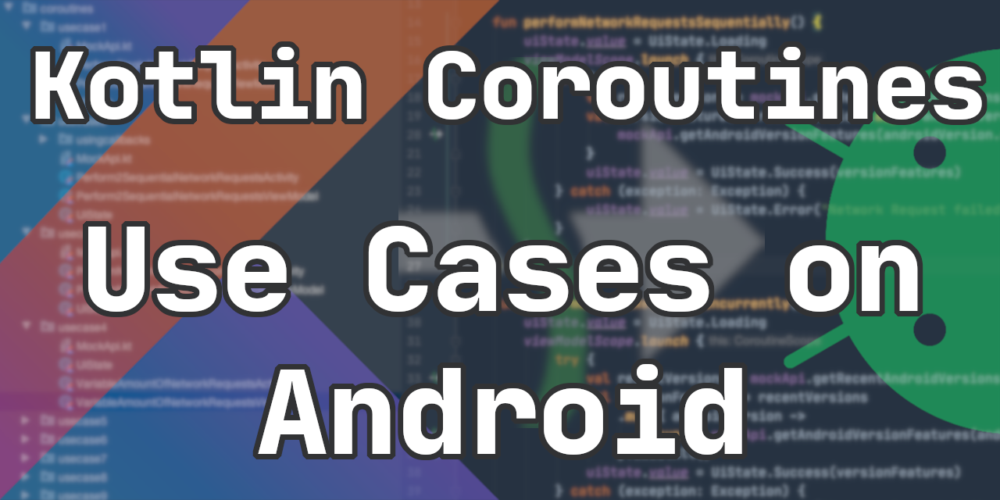

# Kotlin Coroutines - Use Cases on Android

🎓 Learning Kotlin Coroutines for Android by example. 

🚀 Sample implementations for real-world Android use cases. 

🛠 Unit tests included!

This repository is intended to be a "Playground Project". You can quickly look up and play around with the different Coroutine Android implementations.
In the `playground` package you can play around with Coroutines examples that run directly on the JVM.

## 🔧 Project Setup

Every use case is using its own `Activity` and `JetPack ViewModel`. The `ViewModel`s contains all the interesting Coroutine related code.
`Activities` listen to `LiveData` events of the `ViewModel` and render received `UiState`s.

This project is using retrofit/okhttp together with a `MockNetworkInterceptor`. This lets you define how the API should behave.
Everything can be configured: http status codes, response data and delays. Every use case defines a certain behaviour of the Mock API.
The API has 2 endpoints. One returns the names of the most recent Android versions and the other one returns the features of a certain
Android version.

Unit Tests exist for most use cases.

## ⭐️ Use Cases
1. [Perform single network request](#1-perform-a-single-network-request)
2. [Perform two sequential network requests](#2-perform-two-sequential-network-requests)
3. [Perform several network requests concurrently](#3-perform-several-network-requests-concurrently)
4. [Perform variable amount of network requests](#4-perform-variable-amount-of-network-requests)
5. [Perform a network request with timeout](#5-perform-network-request-with-timeout)
6. [Retrying network requests](#6-retrying-network-requests)
7. [Network requests with timeout and retry](#7-network-requests-with-timeout-and-retry)
8. [Room and Coroutines](#8-room-and-coroutines)
9. [Debugging Coroutines](#9-debugging-coroutines)
10. [Offload expensive calculation to background thread](#10-offload-expensive-calculation-to-background-thread)
11. [Cooperative Cancellation](#11-cooperative-cancellation)
12. [Offload expensive calculation to several Coroutines](#12-offload-expensive-calculation-to-several-coroutines)
13. [Exception Handling](#13-exception-handling)
14. [Continue Coroutine execution even when the user leaves the screen](#14-continue-coroutine-execution-when-the-user-leaves-the-screen)
15. [Using WorkManager with Coroutines](#15-using-workmanager-with-coroutines)
16. [Performance analysis of dispatchers, number of coroutines and yielding](#16-performance-analysis-of-dispatchers-number-of-coroutines-and-yielding)

## 📄 Description

### 1. Perform single network request

Performs a single network request to get the latest Android Versions.

[[code](app/src/main/java/com/lukaslechner/coroutineusecasesonandroid/usecases/coroutines/usecase1/PerformSingleNetworkRequestViewModel.kt)]

### 2. Perform two sequential network requests

Performs two network requests sequentially. First it retrieves recent Android Versions and then it requests the features of the latest version.
There also exists an alternative implementation for this use case which uses traditional callbacks. It should demonstrate how much shorter and more readable the Coroutine version is compared to the approach with callbacks.

[[code](app/src/main/java/com/lukaslechner/coroutineusecasesonandroid/usecases/coroutines/usecase2/Perform2SequentialNetworkRequestsViewModel.kt)]

### 3. Perform several network requests concurrently

Performs three network requests concurrently. It loads the feature information of the 3 most recent Android Versions. Additionally, an implementation
that performs the requests sequentially is included. The UI shows how much time each implementation takes to load the data so you can see that the network
requests in the concurrent version are actually performed in parallel. The included unit test is also interesting, as it shows how you can use virtual time to
verify that the concurrent version really gets performed in parallel.

[[code](app/src/main/java/com/lukaslechner/coroutineusecasesonandroid/usecases/coroutines/usecase3/PerformNetworkRequestsConcurrentlyViewModel.kt)]

### 4. Perform variable amount of network requests

Demonstrates the simple usage of `map()` to perform a dynamic amount of network requests. At first, this use case performs a network request to load all Android versions.
Then it performs a network request for each Android version to load its features. It contains an implementation that performs the network requests sequentially and another one that performs them concurrently.

[[code](app/src/main/java/com/lukaslechner/coroutineusecasesonandroid/usecases/coroutines/usecase4/VariableAmountOfNetworkRequestsViewModel.kt)]

### 5. Perform network request with timeout

This use case uses the suspending function `withTimeout()` from the coroutines-core library. It throws a `TimeoutCancellationException` if the timeout was exceeded.
You can set the duration of the request in the UI and check the behaviour when the response time is bigger than the timeout.

[[code](app/src/main/java/com/lukaslechner/coroutineusecasesonandroid/usecases/coroutines/usecase5/NetworkRequestWithTimeoutViewModel.kt)]

### 6. Retrying network requests

Demonstrates the usage of higher order functions together with coroutines. The higher order function `retry()` retries a certain suspending operation for a given amount of times.
It uses an exponential backoff for retries, which means that the delay between retries increases exponentially. The behavior of the Mock API is defined in a way that it responses
with 2 unsuccessful responses followed by a successful response.

[[code](app/src/main/java/com/lukaslechner/coroutineusecasesonandroid/usecases/coroutines/usecase6/RetryNetworkRequestViewModel.kt)]

Unit tests verify the amount of request that are performed in different scenarios. Furthermore they check if the exponential backoff is working properly
by asserting the amount of elapsed virtual time.

### 7. Network requests with timeout and retry

Composes higher level functions `retry()` and `withTimeout()`. Demonstrates how simple and readable code written with Coroutines can be.
The mock API first responds after the timeout and then returns an unsuccessful response. The third attempt is then successful.

[[code](app/src/main/java/com/lukaslechner/coroutineusecasesonandroid/usecases/coroutines/usecase7/TimeoutAndRetryViewModel.kt)]

### 8. Room and Coroutines

This example stores the response data of each network request in a Room database. This is essential for any "offline-first" app.
If the `View` requests data, the `ViewModel` first checks if there is data available in the database. If so, this data is returned before performing
a network request to get fresh data.

[[code](app/src/main/java/com/lukaslechner/coroutineusecasesonandroid/usecases/coroutines/usecase8/RoomAndCoroutinesViewModel.kt)]

### 9. Debugging Coroutines

This is not really a use case, but I wanted to show how you can add additional debug information about the Coroutine that is currently running to your logs.
It will add the Coroutine name next to the thread name when calling `Thread.currentThread.name()`
This is done by enabling Coroutine Debug mode by setting the property `kotlinx.coroutines.debug` to `true`.

[[code](app/src/main/java/com/lukaslechner/coroutineusecasesonandroid/usecases/coroutines/usecase9/DebuggingCoroutinesViewModel.kt)]

### 10. Offload expensive calculation to background thread

This use case calculates the factorial of a number. The calculation is performed on a background thread using the default Dispatcher.

[[code](app/src/main/java/com/lukaslechner/coroutineusecasesonandroid/usecases/coroutines/usecase10/CalculationInBackgroundViewModel.kt)]

In the respective unit test, we have to pass the testDispatcher to the ViewModel, so that the calculation is not performed on a background thread but on the main thread.

### 11. Cooperative cancellation

UseCase#10 has a problem. It is not able to prematurely cancel the calculation because it is not cooperative regarding cancellation. This leads to wasted device resources and
memory leaks, as the calculation is not stopped and ViewModel is retained longer than necessary. This use case now fixes this issue. The UI now also has a "Cancel Calculation"
Button. Note: Only the calculation can be cancelled prematurely but not the `toString()` conversion.

There are several ways to make your coroutines cooperative regarding cancellation: You can use either use `isActive()`, `ensureActive()` or `yield()`.
More information about cancellation can be found [here](https://medium.com/androiddevelopers/exceptions-in-coroutines-ce8da1ec060c)

[[code](app/src/main/java/com/lukaslechner/coroutineusecasesonandroid/usecases/coroutines/usecase11/CooperativeCancellationViewModel.kt)]

### 12. Offload expensive calculation to several Coroutines

The factorial calculation here is not performed by a single coroutine, but by an amount of coroutines that can be defined in the UI. Each coroutine calculates the factorial of a sub-range.

[[code viewmodel](app/src/main/java/com/lukaslechner/coroutineusecasesonandroid/usecases/coroutines/usecase12/CalculationInSeveralCoroutinesViewModel.kt)]
[[code factorial calculator](app/src/main/java/com/lukaslechner/coroutineusecasesonandroid/usecases/coroutines/usecase12/FactorialCalculator.kt)]

### 13. Exception Handling

This use case demonstrates different ways of handling exceptions using `try/catch` and `CoroutineExceptionHandler`. It also demonstrates when you should to use `supervisorScope{}`: In situations when you don't want a failing coroutine to cancel
its sibling coroutines. In the use case the results of the successful responses are shown even tough one response wasn't successful.

[[code](app/src/main/java/com/lukaslechner/coroutineusecasesonandroid/usecases/coroutines/usecase13/ExceptionHandlingViewModel.kt)]

### 14. Continue Coroutine execution when the user leaves the screen

Usually, when the user leaves the screen, the `ViewModel` gets cleared and all the coroutines launched in `viewModelScope` get cancelled. Sometimes we want a certain coroutine operation to be continued
when the user leave the screen. In this use case, the network request keeps running and the results still get inserted into the database
cache when the user leaves the screen. This makes sense in real world application as we don't want to cancel an already started background "cache sync".

You can test this behavior in the UI by clearing the database, then loading the Android version and instantly close the screen. You will see in LogCat that the response
still gets executed and the result still gets stored. The respective unit test `AndroidVersionRepositoryTest` also verifies this behavior. Check out this [blogpost](https://medium.com/androiddevelopers/coroutines-patterns-for-work-that-shouldnt-be-cancelled-e26c40f142ad) for details of the implementation.

[[code viewmodel](app/src/main/java/com/lukaslechner/coroutineusecasesonandroid/usecases/coroutines/usecase14/ContinueCoroutineWhenUserLeavesScreenViewModel.kt)]
[[code repository](app/src/main/java/com/lukaslechner/coroutineusecasesonandroid/usecases/coroutines/usecase14/AndroidVersionRepository.kt)]

### 15. Using WorkManager with Coroutines

Demonstrates how you can use WorkManager together with Coroutines. When creating a subclass of `CoroutineWorker` instead of `Worker`,
the `doWork()` function is now a `suspend function` which means that we can now call other suspend functions. In this
example, we are sending an analytics request when the user enters the screen, which is a nice use case for using WorkManager.

[[code viewmodel](app/src/main/java/com/lukaslechner/coroutineusecasesonandroid/usecases/coroutines/usecase15/WorkManagerViewModel.kt)]
[[code worker](app/src/main/java/com/lukaslechner/coroutineusecasesonandroid/usecases/coroutines/usecase15/AnalyticsWorker.kt)]

### 16. Performance analysis of dispatchers, number of coroutines and yielding

This is an extension of use case #12 (Offload expensive calculation to several coroutines). Here it is possible to additionally define the dispatcher type you want
the calculation to be performed on. Additionally, you can enable or disable the call to `yield()` during the calculation. A list of calculations is displayed on the bottom in order to be able to compare them in a convenient way.

You can play around and check the performance of different configurations!

## 👷‍♀️ Contributing 👷‍♂️

I am currently learning Coroutines myself. So if you have any ideas for or improvements or other use cases, feel free to create a pull request or an issue.

## Author

[Lukas Lechner](https://www.lukaslechner.com)

[Twitter](https://twitter.com/LukasLechnerDev) 

## License

Licensed under the Apache License, Version 2.0 (the "License").
You may obtain a copy of the License at

   http://www.apache.org/licenses/LICENSE-2.0

Unless required by applicable law or agreed to in writing, software
distributed under the License is distributed on an "AS IS" BASIS,
WITHOUT WARRANTIES OR CONDITIONS OF ANY KIND, either express or implied.
See the License for the specific language governing permissions and
limitations under the License.

You agree that all contributions to this repository, in the form of fixes, pull-requests, new examples etc. follow the above-mentioned license.
