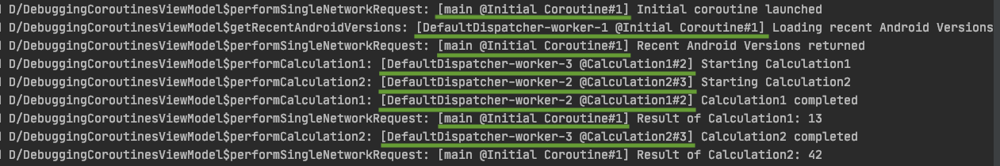

# Coroutine Use Cases on Android

This project contains a lot of real-world Android use cases implemented with Kotlin Coroutines, Channels and Flow.

Currently, it is in heavy "Work in Progress". Most of the examples aren't implemented yet.

## Coroutines Use Cases
1. [Performing a single network request](#1-performing-a-single-network-request)
2. [Performing two sequential network request](#2-performing-two-sequential-network-requests)
3. Performing several network requests concurrently
4. Performing a variable amount of network requests, depending on the amount of data sets received from the first network request
5. Performing a network request with a timeout
6. Retrying network requests
7. [Room and Coroutines](#7-room-and-coroutines)
8. [Debugging Coroutines](#8-debugging-coroutines)
8. Offload a heavy calculation from the main thread
9. Offload a heavy calculation to several Coroutines
10. Handling Exceptions
11. Coroutine Cancellation
12. Continue Coroutine execution even when the user has already left the screen
13. Using WorkManager together with Coroutines
14. [Wrapping Callback based API](#15-wrapping-callback-based-api)

## Channels Use Cases
WIP

## Flow Use Cases
WIP

## Coroutines Use Cases Description

### 1. Performing a single network request

Almost every real Android application needs to do some networking.

### 2. Performing two sequential network requests

Performs one network request after the other.

### 7. Room and Coroutines

This example stores the response data of each network request in a Room database. This is essential for any "offline-first" app.
If the `View` requests data, the `ViewModel` first checks if there is data available in the database. If so, this data is returned before performing
a network request to get fresh data.

### 8. Debugging Coroutines

Shows how you can add additional debug information about the Coroutine that is currently running to your logs.
It will add the Coroutine name next to the thread name when calling `Thread.currentThread.name()`
This is done by enabling Coroutine Debug mode by setting the property `kotlinx.coroutines.debug` to `true`.
This is how it will look like in LogCat:

### 15. Wrapping callback based API

See e.g. https://medium.com/androiddevelopers/suspending-over-views-19de9ebd7020

## License

Licensed under the Apache License, Version 2.0 (the "License").
You may obtain a copy of the License at

   http://www.apache.org/licenses/LICENSE-2.0

Unless required by applicable law or agreed to in writing, software
distributed under the License is distributed on an "AS IS" BASIS,
WITHOUT WARRANTIES OR CONDITIONS OF ANY KIND, either express or implied.
See the License for the specific language governing permissions and
limitations under the License.

You agree that all contributions to this repository, in the form of fixes, pull-requests, new examples etc. follow the above-mentioned license.
